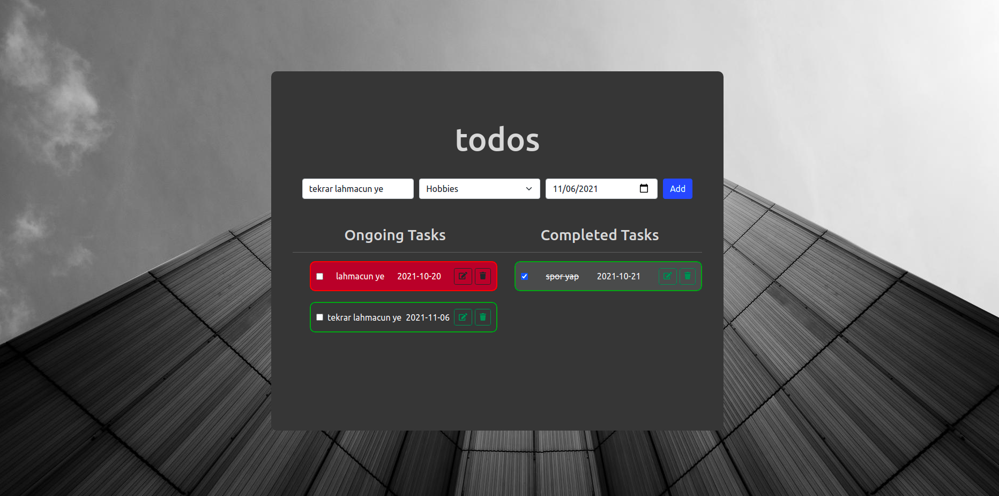
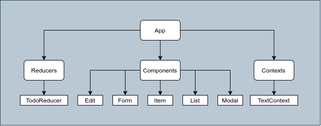

# Todos App

In this project, I've created a Todos List Application with ReactJS library. It is the first ReactJS project which I've completed so far. 

You can view the latest version of the project, click to this netlify link: **https://hw2-todo-app-react.netlify.app/**



## How to setup

In order to setup this application, follow these steps 

- Download the my repository where I'm posting the homeworks though

```
$ git clone https://github.com/135-Inveon-FullStack-Bootcamp-Classroom/BerkeSenturk_Homeworks.git

$ cd hw2-todos-app-react 

$ npm install
```

Finally you can start the app as follows

```
$ npm start
```

## Technical Details

Through this project, I've learned so many technical details about React framework and it's modules. If you want to learn the technical details of my project, dive into the this cool chapter!

I've learned and used:

- Hooks:
    - useState
    - useEffect
    - useReducer

- Concepts
    - Context API

- Data Storage
    - Local Storage

- Design
    - React-Bootstrap

### Data Structure & Local Storage

I used local storage for storing data permanently on browser. The data structure is an array containing JSON data.

For example,

```
todos = [{
            "id":"90190697213776514270675642",
            "title":"first",
            "category":"Sport",
            "isCompleted":false,
            "date":"2021-10-28",
            "isDued":true
        },
        {
            "id":"54528901526766885963217867",
            "title":"second",
            "category":"Business",
            "isCompleted":false,
            "date":"2021-10-30",
            "isDued":false
        }]
```


### Components Diagram

There are three main parts:


