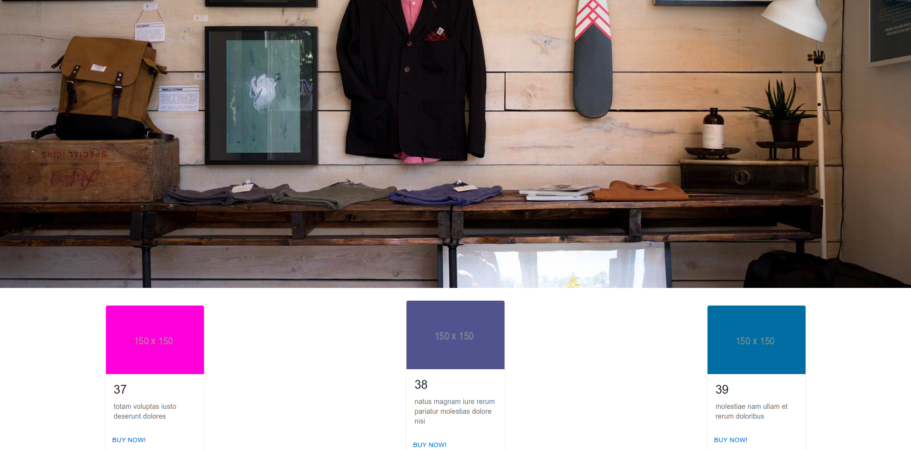
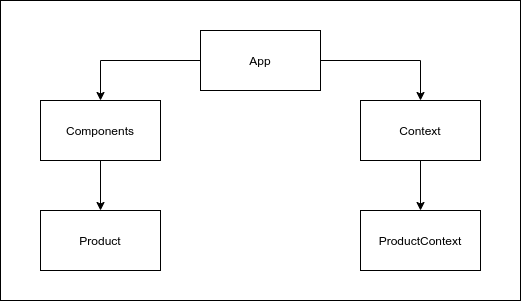

# Fake Store Project

Fake Store App has limited number of product records in each page which can be controlled by moving forward or backwards through the pagination feature.



## Component Diagram

- Components
    - Product

- Context (Context API)
    - ProductContext



## Live Demo

You can view the live demo thereby clicking this link: https://xenodochial-bohr-98cea3.netlify.app/

## How to Setup?

```
$ git clone https://github.com/135-Inveon-FullStack-Bootcamp-Classroom/BerkeSenturk_Homeworks.git
```

```
$ cd fake-store

$ npm install

$ npm start
```