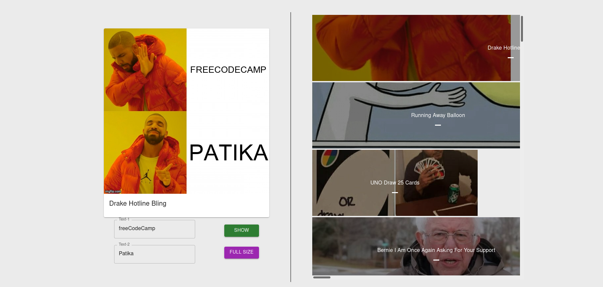

# Meme Generator App

## About



This is the first Redux project which I've completed so far. 

In this project I created a meme generator app that simply allows you to click one of the memes shown in the image list on the right side of the app. Once you click one of the images on the right panel, it updates the current image and ready to go for creating your funny meme.

After that, you may input some texts in order to enhance your meme. Once you click on to the ```SHOW``` button, it updates the current image with the texts you have written before. Also, you may view the full size of the image through clicking to the ```FULL SIZE``` button

## Live Demo

Want to see the live demo? Click on to this link: ```https://priceless-cray-a5ac9b.netlify.app```

## How to Install?

```
$ git clone https://github.com/135-Inveon-FullStack-Bootcamp-Classroom/BerkeSenturk_Homeworks.git
```

```
$ cd week4/meme-creator-app

$ npm install

$ npm start
```