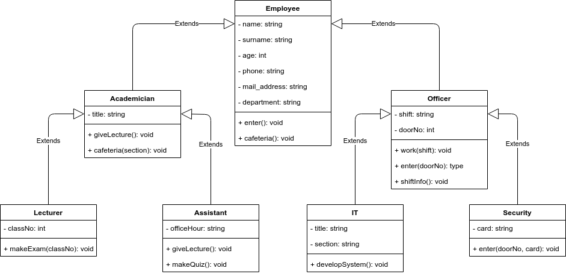

# Oop Principles Homework

## About

This homework is created for understanding the basics of Object Oriented Programming (OOP), C# and .NET 5. 

There are four Object Oriented Programming principles:

- Encapsulation
- Abstraction
- Inheritance
- Polymorphism

All of these OOP principles are used in this homework.

## UML Diagram



## Setup the Project

In order to install the project in your computer, apply the following commands.

```
git clone git@github.com:135-Inveon-FullStack-Bootcamp-Classroom/BerkeSenturk_Homeworks.git
```
```
cd week5/oopExample
```

You may run the project by simply applying,

```
dotnet run Program.cs
```