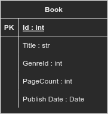
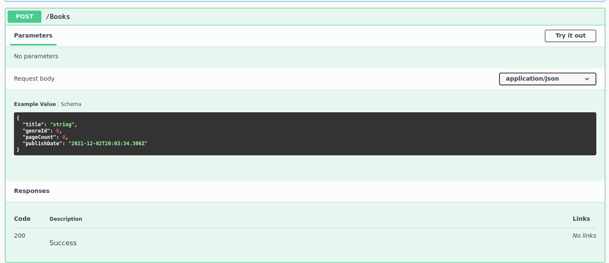
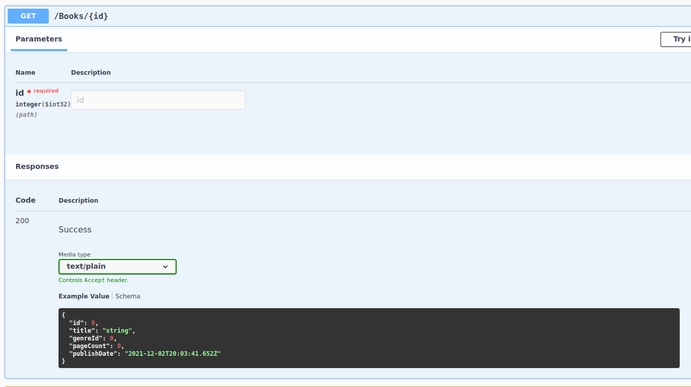
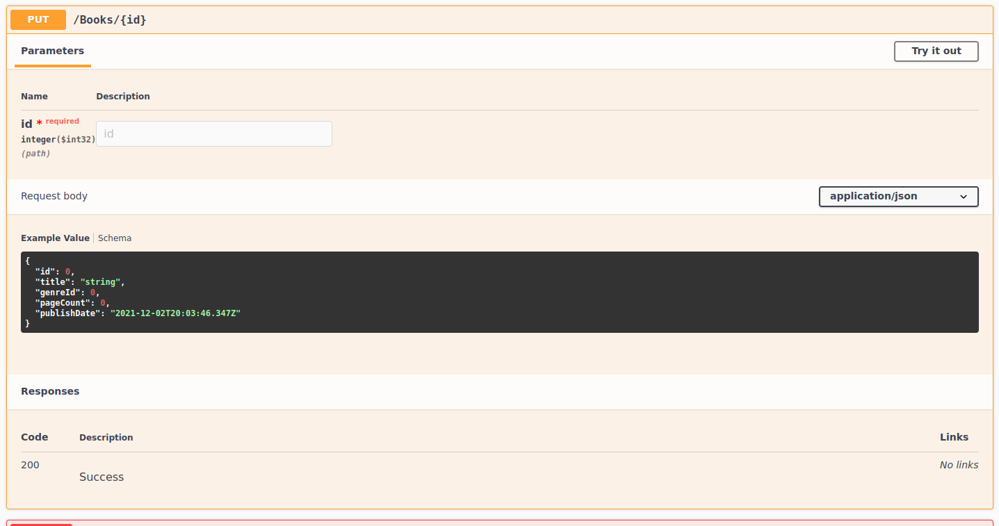
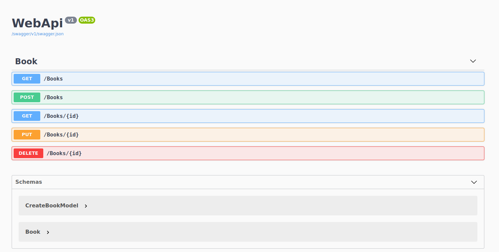

# Book Store WebApi Project

## About

This is a simple project which is built parallel with the Patika tutorials. The purpose of this project is building a RESTful API with Entity Framework for the first time through .NET Core & C#.

## Folder Structure 

WebApi
|
|
|_ BookOperations : For defining Create and Get features of CRUD application.
|
|
|_ Common
|
|
|_ DBOperations : For handling Db integration

## Entity

For this introductory project there is only one entity is created called ```Book```

The schema of the Book table as follows



## CRUD Operations


There are five operations created: 

- Create Book: Create a new book to db



- Get Books: Gets all the books from db
- Get Book by Id: Gets the book data by Id



- Put Book: Updates the data of existing book by Id



- Delete Book: Deletes the data of book by Id


