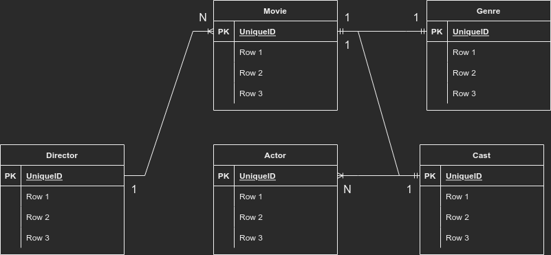

# Movie Store

## About 

Movie Store is the project built with the tech stack as follows:

- .NET Core & C#
- Entity Framework
- Automapper & Dependency Injection

## CQRS

Within this project, CQRS architecture approach is used despite the Book Store project also accomplished inside the 6th week of the bootcamp.

For having further knowledge about CQRS (Command Query Responsibility Segregation) : https://martinfowler.com/bliki/CQRS.html

## ER Schema and Entities

The ER (Entity Relation Schema) of the database has shown on the figure below

## CRUD Operations

EXPLAINED SOON!